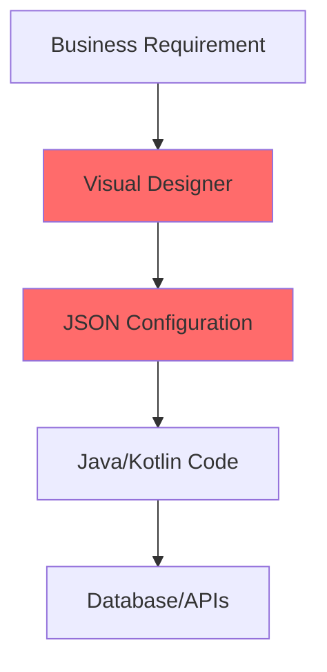
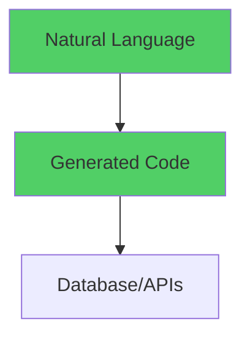

# Valtimo's Low-Code Approach
## A Critical Analysis in the Age of AI

<div class="pt-12">
  <span @click="$slidev.nav.next" class="px-2 py-1 rounded cursor-pointer" hover="bg-white bg-opacity-10">
    How AI is disrupting traditional low-code platforms →
  </span>
</div>

<div class="abs-br m-6 flex gap-2">
  <button @click="$slidev.nav.openInEditor()" title="Open in Editor" class="text-xl slidev-icon-btn opacity-50 !border-none !hover:text-white">
    <carbon:edit />
  </button>
  <a href="https://github.com/valtimo-platform" target="_blank" alt="GitHub" title="Open in GitHub"
    class="text-xl slidev-icon-btn opacity-50 !border-none !hover:text-white">
    <carbon-logo-github />
  </a>
</div>

---
transition: fade-out
---

# Executive Summary

<v-clicks>

- 🎯 **Valtimo**: Sophisticated low-code platform for business process automation
- 🚨 **Challenge**: AI transforms software development paradigms
- 📊 **Analysis**: Traditional low-code approaches face fundamental obsolescence
- 💡 **Insight**: Natural language to code generation eliminates abstraction layers

</v-clicks>

<br>

<v-click>

## Key Question
*Why maintain complex visual builders when AI can generate code directly from requirements?*

</v-click>

---

# Valtimo's Low-Code Vision

## The Promise

<div grid="~ cols-2 gap-4">
<div>

### Target Users
- **Business analysts** - create workflows without coding
- **System administrators** - configure integrations visually
- **Implementation consultants** - rapid solution deployment
- **Citizen developers** - simple app building

</div>
<div>

### Target Market
- **Government agencies** - ZGW compliance required
- **Enterprise organizations** - case management needs
- **Regulated industries** - audit and compliance focus
- **Cost-conscious orgs** - reduce IT dependency

</div>
</div>

---
transition: slide-up
---

# The Reality Check: BPMN Modeling

<div grid="~ cols-2 gap-4">

<div>

## Current Approach
```xml {all|1-2|3-6|all}
<bpmn:process id="mortgage-application">
  <bpmn:userTask id="review-documents">
    <bpmn:extensionElements>
      <camunda:formKey>
        formio:document-review-form
      </camunda:formKey>
    </bpmn:extensionElements>
  </bpmn:userTask>
</bpmn:process>
```

</div>

<div v-click>

## Problems
- 🎓 **Still technical** - requires BPMN training
- 🔧 **Complex modeling** - as complex as code
- 👨‍💻 **Developer dependency** - non-trivial logic needs devs
- 📄 **XML configuration** - not truly "no-code"

</div>

</div>

---

# Form Builder Complexity

<div grid="~ cols-2 gap-4">

<div>

## FormIO Configuration
```json {all|3-5|6-8|9|all}
{
  "type": "textfield",
  "key": "applicantName",
  "validate": {
    "required": true
  },
  "defaultValue": "{{doc:applicant.name}}",
  "conditional": {
    "show": true,
    "when": "applicationStatus",
    "eq": "draft"
  }
}
```

</div>

<div v-click>

## Reality Check
- 🧩 **Complex JSON** - technical for non-devs
- 🔗 **Field mapping** - `doc:`, `pv:` syntax requires system knowledge
- ⚡ **Conditional logic** - unwieldy without programming constructs
- 🛠️ **Custom validation** - still needs code

</div>

</div>

---
layout: center
class: text-center
---

# The AI Disruption

## From Visual Builders to Natural Language

---

# The AI Paradigm Shift

<div grid="~ cols-2 gap-4">

<div>

## Traditional Low-Code Stack


<p class="text-red-500 text-sm">Multiple abstraction layers</p>

</div>

<div v-click>

## AI-First Stack


<p class="text-green-500 text-sm">Direct generation</p>

</div>

</div>

---

# Natural Language vs Visual Builders

<v-clicks>

## Instead of Visual Configuration...

```
User: "Create a mortgage application process where documents are
reviewed, credit is checked automatically via API, and approvals
require manager sign-off for amounts over $500k"
```

## AI Generates...
- ✅ Complete BPMN process
- ✅ Forms with validation
- ✅ API integrations
- ✅ Business rules
- ✅ Database schema
- ✅ Test suites

</v-clicks>

<v-click>

**Result**: Hours instead of weeks, single conversation, production-ready code

</v-click>

---

# Critical Low-Code vs High-Code Disadvantages

<div grid="~ cols-2 gap-4">

<div>

## Low-Code Fundamental Issues
- 🧪 **Testing nightmare** - visual configs can't be unit tested
- 📝 **Version control hell** - JSON blobs don't merge well
- 🔧 **No IDE support** - limited debugging capabilities
- 🚧 **Platform constraints** - can't do everything in code
- 📈 **Technical debt** - configurations become unmaintainable
- 👥 **Specialist scarcity** - very few platform experts available

</div>

<div v-click>

## High-Code + AI Advantages
- ✅ **Comprehensive testing** - generated test suites included
- 🔄 **Git-friendly** - line-by-line diffs and code review
- 🛠️ **Full IDE support** - debugging, refactoring, static analysis
- 🚀 **No limitations** - access to all language features
- 📊 **Higher quality** - best practices built-in
- 👥 **Abundant talent** - millions of Java developers available

</div>

</div>

---

# The Speed Myth: Low-Code vs AI High-Code

<div grid="~ cols-2 gap-4">

<div>

## Traditional Low-Code Promise
🚀 **Fast delivery** - main selling point
⚖️ **Trade-offs accepted**:
- Limited testing capabilities
- Poor version control
- Platform vendor lock-in
- Reduced flexibility

<br>

**Assumption**: Speed worth the limitations

</div>

<div v-click>

## AI High-Code Reality
⚡ **Same speed** - AI generates code as fast as configuration
🎯 **No trade-offs**:
- Comprehensive test suites included
- Git-friendly code with proper diffs
- Zero vendor lock-in
- Complete programming flexibility

<br>

**Result**: Speed + Quality + Maintainability

</div>

</div>

---

# Case Study: Mortgage Application

<div grid="~ cols-2 gap-4">

<div>

## Traditional Valtimo Approach

**Required Artifacts:**
- BPMN process definition (XML)
- FormIO form definitions (JSON)
- Document schema (JSON Schema)
- Plugin configurations (JSON)
- Permission configurations (JSON)
- Dashboard configurations (JSON)

**Required Skills:**
- BPMN modeling
- FormIO syntax
- JSON Schema design
- Valtimo field mapping
- Environment management

**Result:** Weeks of work, multiple specialists

</div>

<div v-click>

## AI-First Approach

**Single Requirement:**
```
"Create a mortgage application system with:
- Customer forms with income verification
- Automatic credit check via Experian
- Document upload and validation
- Manager approval for loans over $500k
- Email notifications at each step
- Audit trail for compliance"
```

**AI Generation:**
- Complete Spring Boot app
- React frontend
- Database schema
- API integrations
- Test suites

**Result:** Hours instead of weeks

</div>

</div>

---

# Testing & Quality: The Hidden Cost

<div grid="~ cols-2 gap-4">

<div>

## Low-Code Testing Reality
❌ **Visual configurations** - can't write unit tests
❌ **JSON workflows** - manual testing only
❌ **Integration points** - difficult to mock
❌ **Regression testing** - nearly impossible
❌ **CI/CD integration** - limited automation

<br>

**Result**: Quality issues discovered in production

</div>

<div v-click>

## AI High-Code Testing
✅ **Generated test suites** - comprehensive coverage from day one
✅ **Unit tests** - every function and component
✅ **Integration tests** - API and database mocking
✅ **E2E tests** - complete user workflow validation
✅ **CI/CD ready** - runs in any pipeline

<br>

**Result**: Production-ready quality by default

</div>

</div>

---
layout: center
class: text-center
---

# Performance & Scalability

## Platform Overhead vs Generated Code

---

# Version Control & Collaboration

<div grid="~ cols-2 gap-4">

<div>

## Low-Code Git Problems
❌ **Large JSON files** - merge conflicts nightmare
❌ **Binary configurations** - can't see meaningful diffs
❌ **Visual models** - impossible to code review
❌ **Configuration drift** - hard to track changes
❌ **Rollback difficulties** - unclear what changed

<br>

**Team Impact**: Collaboration becomes frustrating

</div>

<div v-click>

## AI High-Code Git Benefits
✅ **Line-by-line diffs** - clear change tracking
✅ **Meaningful code review** - reviewable logic
✅ **Clean merges** - standard conflict resolution
✅ **Granular commits** - precise change history
✅ **Easy rollbacks** - standard Git workflows

<br>

**Team Impact**: Seamless developer collaboration

</div>

</div>

---

# Government Sector Implications

<v-clicks>

## Why Low-Code Appeals to Government
- 🏛️ Reduced vendor dependency
- 🔧 Internal capability building
- 🚀 Faster procurement (configure vs develop)
- ✅ Compliance through configuration

## Why AI is Better for Government
- 🔍 **Transparency** - fully auditable generated code
- 🔒 **Security** - no hidden platform vulnerabilities
- 🎯 **Customization** - full adaptation to requirements
- 💰 **Cost** - eliminate platform licensing
- 🏛️ **Sovereignty** - own the generated code completely

</v-clicks>

---

# Dutch ZGW Compliance Example

<div grid="~ cols-2 gap-4">

<div>

## Current Valtimo Approach
```json
{
  "pluginDefinitionKey": "zaak-api",
  "properties": {
    "url": "${ZAKEN_API_URL}",
    "clientId": "${ZAKEN_CLIENT_ID}",
    "authenticationPlugin": "oauth2-config"
  }
}
```

*Still requires understanding of ZGW APIs, OAuth2, environment variables*

</div>

<div v-click>

## AI-Generated Approach
```
"Generate a case management system compliant
with ZGW standards including Zaken API,
Documenten API, and Besluiten API integration
with full audit trails and GDPR compliance"
```

*Result: Purpose-built system without platform dependencies*

</div>

</div>

---

# The Economics of Platform Obsolescence

<div grid="~ cols-2 gap-4">

<div>

## Low-Code Platform Costs
- 💰 **Initial** - licensing, training, implementation
- 🔄 **Ongoing** - renewals, upgrades, migration
- 🔒 **Hidden** - vendor lock-in, performance limits

## Skills Investment Risk
- 🎓 Platform-specific knowledge doesn't transfer
- 🔧 Specialized consultants required
- 📉 Technical debt in configurations

</div>

<div v-click>

## AI-First Economics
- 💻 **Initial** - AI tools, developer training
- ✅ **Ongoing** - own code completely
- 📈 **Benefits** - standard skills, no lock-in

## Future-Proof Investment
- 🔄 Continuous improvement through regeneration
- 🏗️ Standard development skills apply
- 🚀 Full optimization capability

</div>

</div>

---
layout: center
class: text-center
---

# Recommendations for Valtimo's Future

---

# The AI Advantage: Speed + Quality

<div grid="~ cols-2 gap-4">

<div>

## Speed Comparison
| Task | Low-Code | AI High-Code |
|------|----------|-------------|
| Simple Form | 2 hours | 5 minutes |
| CRUD API | 1 day | 10 minutes |
| Complex Workflow | 1 week | 30 minutes |
| Full App | 2-3 months | 2-3 hours |

</div>

<div v-click>

## Quality Comparison
| Aspect | Low-Code | AI High-Code |
|--------|----------|-------------|
| Testing | Manual only | Comprehensive |
| Version Control | Poor | Excellent |
| Debugging | Limited | Full IDE |
| Portability | Locked-in | Universal |
| Maintainability | Difficult | Standard |

</div>

</div>

</div>

---

# Talent Pool: The Hidden Crisis

<div grid="~ cols-2 gap-4">

<div>

## Low-Code Specialist Reality
- 👥 **Valtimo experts**: <500 worldwide
- 💰 **Premium rates**: $120-180k annually
- 🎓 **Training time**: 6-12 months to proficiency
- 🔒 **Knowledge lock-in**: Skills don't transfer
- 📈 **High turnover**: Limited career progression
- 🔍 **Recruitment nightmare**: Extremely difficult to hire

</div>

<div v-click>

## Java Developer Abundance
- 👥 **Java developers**: 9+ million globally
- 💰 **Competitive rates**: $70-120k annually
- 🎓 **Quick ramp-up**: AI assistance accelerates learning
- 🔄 **Transferable skills**: Knowledge applies everywhere
- 📈 **Career growth**: Clear advancement paths
- 🎯 **Easy recruitment**: Large, accessible talent pool

</div>

</div>

<br>

<v-click>

<div class="text-center text-xl text-green-500">
**Result**: AI + Java = Speed + Quality + Available Talent
</div>

</v-click>

---

# Implementation Roadmap

<div grid="~ cols-3 gap-4">

<div>

## Phase 1: Pilot
**Next 6 Months**
- 🧪 AI-powered form generation
- 🔄 Natural language to BPMN
- 📊 Measure productivity gains

</div>

<div>

## Phase 2: Hybrid
**6-12 Months**
- 🤝 AI + platform integration
- 🎯 Domain-specific training
- 👥 Customer migration path

</div>

<div>

## Phase 3: AI-First
**12+ Months**
- 🚀 Full code generation
- 🏛️ Government-specific models
- 🎪 Platform independence

</div>

</div>

---
layout: center
class: text-center
---

# The Future Landscape

---

# Where Platforms Struggle vs Where AI Excels

<div grid="~ cols-2 gap-4">

<div>

## Traditional Platforms Struggle
- 🎯 **Generic solutions** for all problems
- 🚧 **Abstraction bottlenecks** limit capability
- 📈 **Maintenance overhead** increases over time
- 🔒 **Platform capabilities** constrain solutions

</div>

<div v-click>

## AI Excels
- 🎪 **Purpose-built** solutions
- 🎯 **Best practices** embedded automatically
- 🔄 **Continuous improvement** through regeneration
- 🚀 **Platform-agnostic** skills become valuable

</div>

</div>

---

# Timeline: The Transition Period

<div class="timeline">

## Next 2-3 Years
- 🔄 Low-code platforms add AI features
- 🤝 Hybrid solutions emerge
- ❓ Organizations question platform dependencies
- 🚀 Skills shortage accelerates AI adoption

<br>

## Beyond 3 Years
- 🎯 AI-first development becomes standard
- 📉 Traditional platforms face obsolescence
- 🚀 Direct code generation replaces visual builders
- 🔄 Platform-agnostic skills become valuable

</div>

---
layout: center
class: text-center
---

# Conclusion

## The End of an Era

---

# Key Insights

<v-clicks>

## The Core Issue
Low-code platforms solve a problem that **no longer exists**: the difficulty of writing code

## The Speed Myth Shattered
AI-generated high-code is now **faster** than low-code configuration while delivering **superior quality**

## The Quality Revolution
With AI, you get:
- **Same delivery speed** as low-code
- **Comprehensive testing** built-in
- **Perfect version control** with Git
- **No vendor lock-in** or platform limitations
- **Full programming flexibility** for any requirement
- **Abundant talent pool** - millions of Java developers vs. hundreds of platform specialists

## The Choice
Why accept low-code limitations and specialist scarcity when AI + standard developers deliver better results faster with abundant talent?

</v-clicks>

---

# The Recommendation

<div class="text-center">

<v-click>

## Pivot to AI-Powered Domain-Specific Code Generation

</v-click>

<br>

<v-clicks>

- 🎯 **Leverage expertise** - Deep government sector knowledge and ZGW compliance
- 🚀 **Generate solutions** - Create purpose-built applications, not configurable platforms
- 🏛️ **Competitive advantage** - Government-specific AI models with compliance built-in
- 🔄 **Future-proof** - Own the generated code, eliminate platform dependencies

</v-clicks>

</div>

<br>

<v-click>

<div class="text-center text-xl">
<strong>The future belongs to those who can generate the right code, not configure the right platform.</strong>
</div>

</v-click>

---
layout: center
class: text-center
---

# Thank You

## Questions & Discussion

<div class="pt-12">
  <span class="px-2 py-1 rounded cursor-pointer" hover="bg-white bg-opacity-10">
    Let's discuss the future of low-code platforms in the AI era
  </span>
</div>

<div class="abs-br m-6 flex gap-2">
  <a href="https://github.com/valtimo-platform" target="_blank" alt="GitHub" title="Valtimo Platform"
    class="text-xl slidev-icon-btn opacity-50 !border-none !hover:text-white">
    <carbon-logo-github />
  </a>
</div>